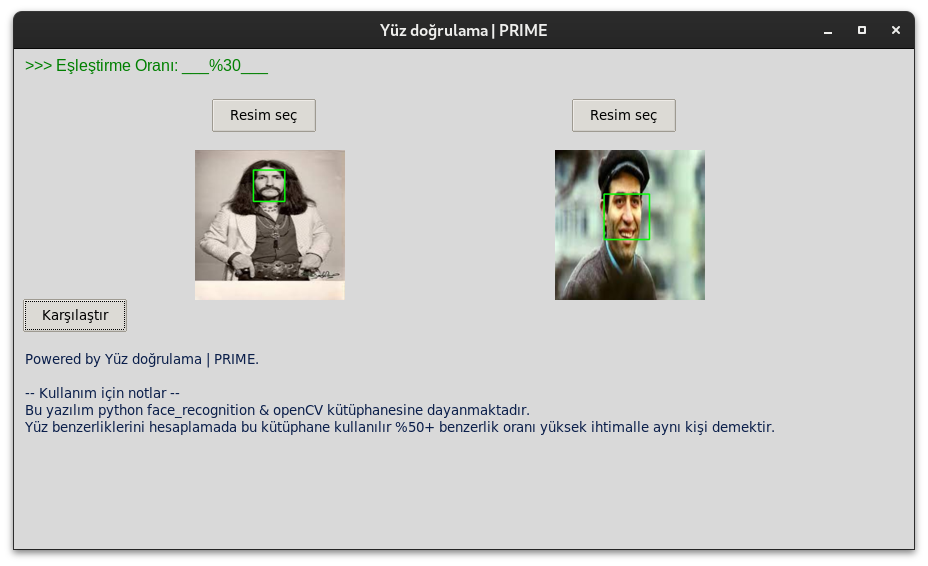
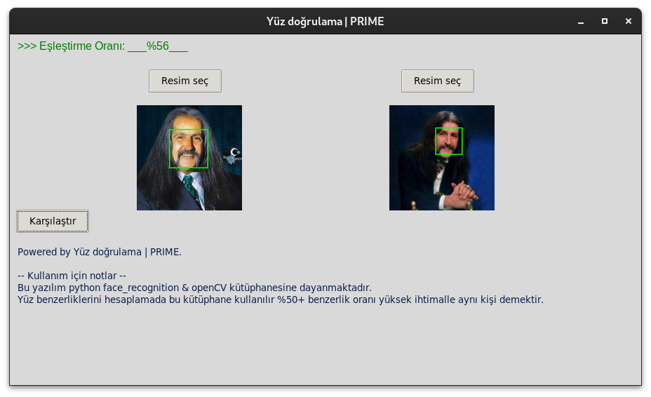
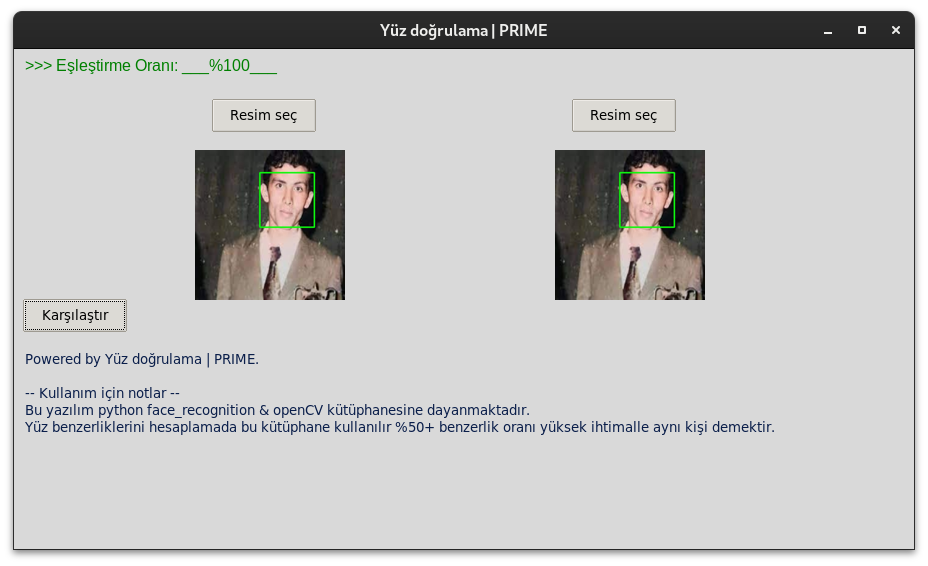

# Yüz Doğrulama
<p>OSINT işlemlerinde kişileri doğrulamak & tespit edebilmek için tasalarnan bir python projesidir. Yüzleri karşılaştırmak için önceden eğitilmiş modeller kullanan face_recognition kütüphanesi, daha doğru eşleşmeler için resimleri yenien boyutlandırmada openCV ve kullanıcı dostu bir arayüz için Tkinter kullanılmaktadır.</p>

</br>


## Gereksinimler:

| Kütüphane | Genel pip paket ismi |
|-----------|----------------------|
| face_recognition | face_recognition |
| tkinter           | tkinter
| OpenCV            | cv2
| subprocess        | subprocess
| pathlib           | pathlib


</br>

### Gereksinimlerin kurulumu:
```bash
python3 -m pip install paket_adı # Linux & MacOS
```
```bash
pip install paket_adı # Windows
```


# Kullanıcı arayüzü:


### <B>Giriş ekranı </B>


</br>

### Farklı yüzlerin karşılaştırma sonucu
 

</br>

### Aynı yüzlerin karşılaştırma sonucu


</br>

# Yenilikler hakkında:

<p>Tespit edilen yüzlerin kare içine alınması arayüz ve sistemde ufak değişiklikler ve geliştirmeler.</p>




</br>

# Geliştirme & Kişiselleştirme:

<p>Proje python3.11 yani yyınlandığı dönemdeki en son sürümle yazılmış olsada önceki sürümlerlede uyumludur 
bunun yanı sıra kodun özelleştirme gerektiren (Program adı, yapımcı bilgisi, bilgi paneli) gibi kısımların büyük çoğunluğu kodun başında belirlenmiştir kolayca özelleştirilebilir ve yeniden dağıtılabilir.</p>


```python
# KUTUPHANE VE TEMP DIZINLERI BELIRLENDI 
CORP_NAME = "PRIME"
APP_NAME = "Yüz doğrulama"
TEMP_PATH = "temp"+str(os.sep)
LIB_PATH = "lib"+str(os.sep)
FULL_PATH_OF_TEMP = str(os.getcwd())+str(os.sep)+TEMP_PATH
```